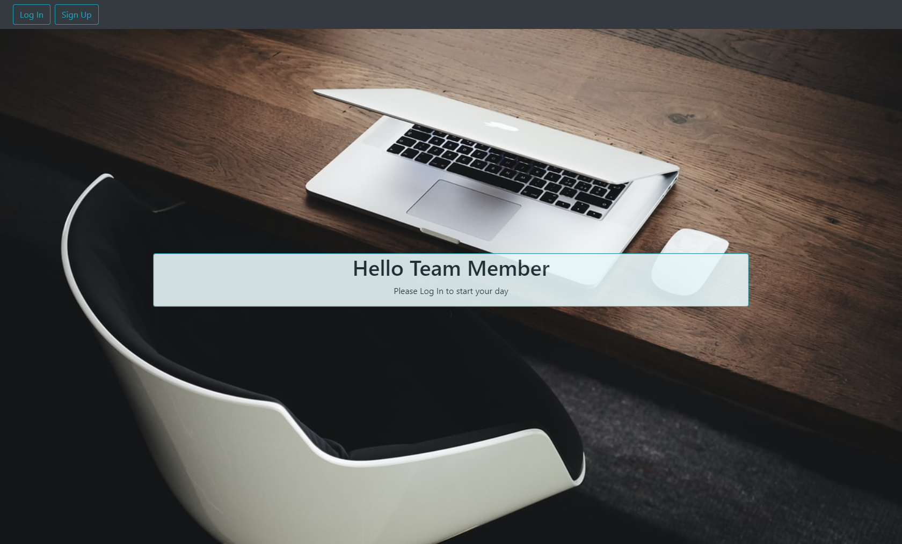

## [ETA](https://eta.herokuapp.com/)

## Description

We are building an application to track an employee's hours but with an added focus on employee's mental health. Giving both employee and employer access to hour logs and a deeper look into employee's well being and overall comfort during their workday.

## User Story

As an employer, I would like to be able to add, update, remove employee information and clock in/clock out time my employees enter. 
As an employer, I would like to have an input box pop up when each employee clocks out for the day that they can rate how their day went and be notified of their response. This will allow me to check in with them when I think they may need help and make sure that the office is running smoothly. 
As an employer, I would like to use the responses from employees to help them correct any issues with resources, one on one meetings, and/or allow my employee to update me on their feeling while at work. 
As an employee, I would like to login and be able to click a clock in/clock out/start lunch button to easily record working hours during the day.
As an employee, I would like to be able to comunicate with my employer any issues I am having during the day at work to help employer give me tools/resources to correct any issues. 

## **Screenshot**

Here is a photo of the Live application

# Link to project 
Look at the live version through Heroku [here.](https://eta-clocking-system.herokuapp.com/)

## Project Team

- ### Front End

    - [David Vargas](https://github.com/davidvargas95)
    - [Jacob Riley](https://github.com/Jr-source)
    - [Truc Nguyen](https://github.com/trucn0215)

- ### Back End

    - [Martin Renteria](https://github.com/MartinRenteria)
    - [Brian Shor](https://github.com/brians-123)
 
  
## Workflow

To start things off, we had two proposals for Project 3. We decided that Truc's idea of  "ETA" app was the one we wanted to make. Truc had a great foundational idea and as a group we decided on a "mental health check" aspect addition that would set us apart from other similar apps.

## Future Goals

- Graph employer
- Employer access to identify trends
- Real time feedback with resources

## Resources

- [clickUp](https://clickup.com/)

## Technologies Used

  
  
  
  
  
  
  

## Installation

- axios
- bootstrap
- moment
- passport
- react-clock
- react-dom
- react-router-dom
- recharts

## Note for developers

- Making sure to have .env file and type JWT_SECRET="ETA" to be able to run to app
